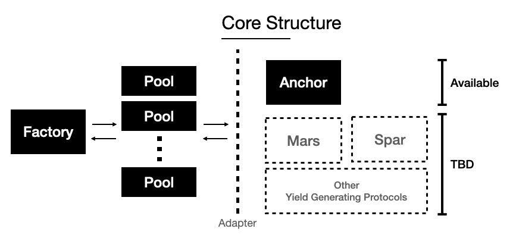

# GoFund US(T) Core

## Table of contents

* [Pool](#Pool) [(source)](pool)

### Factory

> Create new pools. 

### Pool

> accepts UST. deposits into Anchor. rewards are claimable by a 3rd party specified at instantiation

